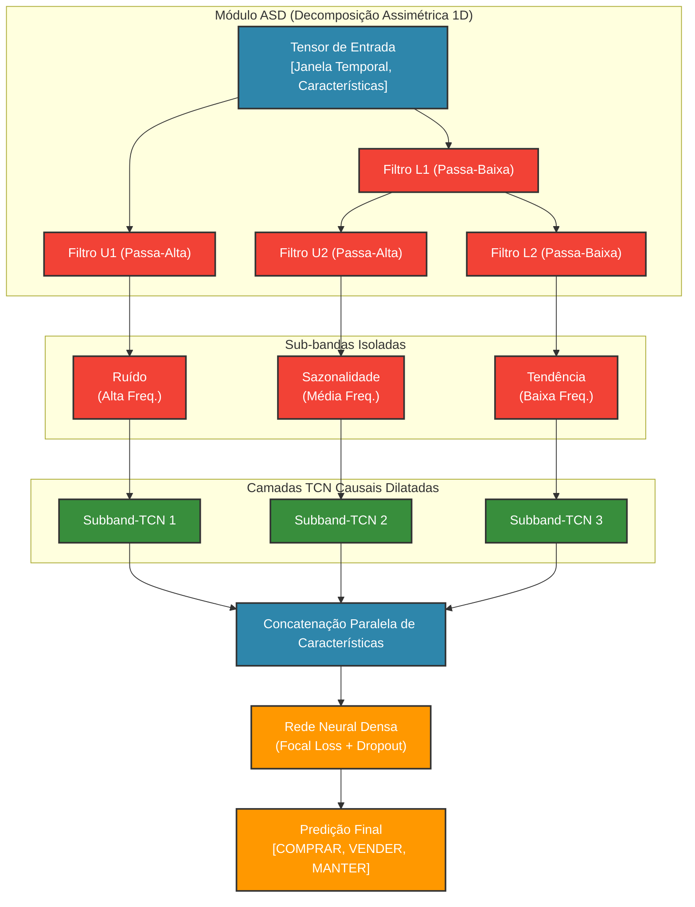
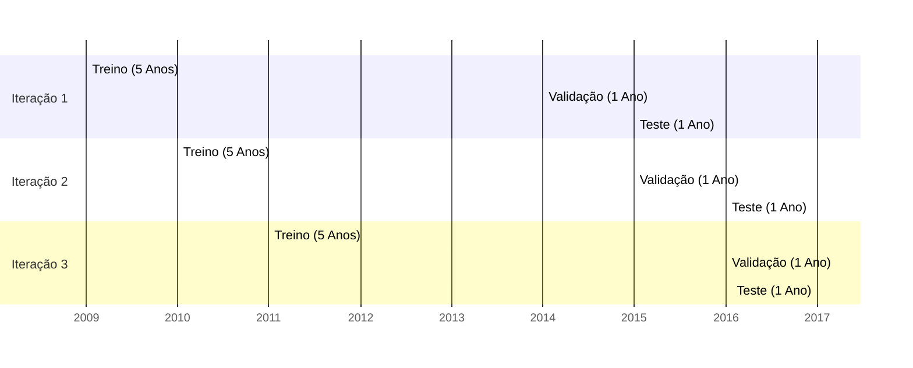
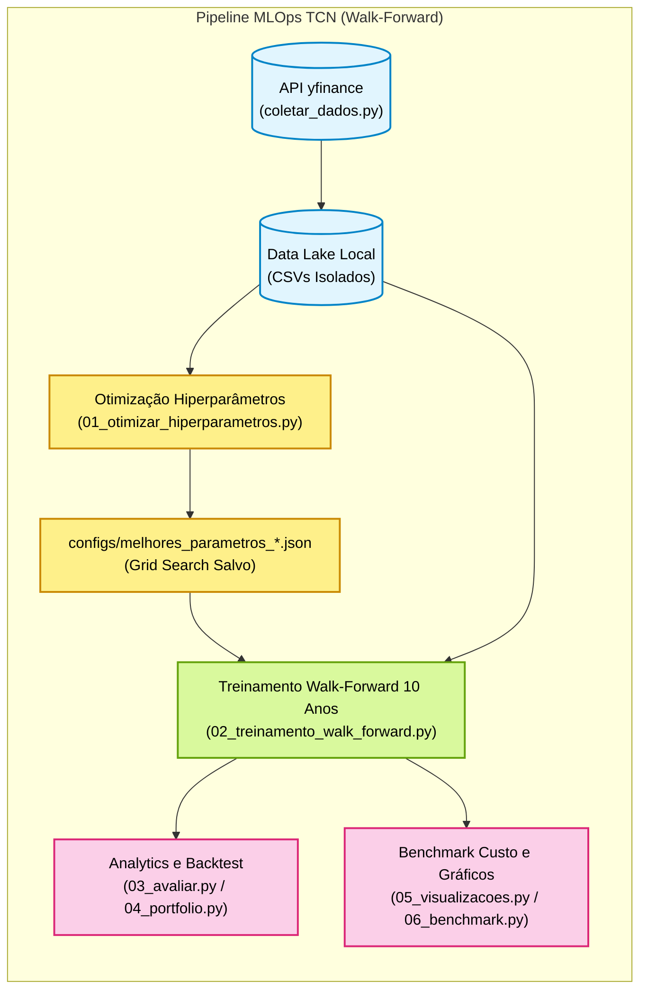

# MSR-TCN: Rede Convolucional Temporal Regularizada por Sub-bandas

[](https://www.python.org/downloads/)
[](https://pytorch.org/)
[](https://opensource.org/licenses/MIT)

Este repositório contém o código-fonte oficial e o pipeline de reprodutibilidade para o modelo **Multichannel Subband Regularized Temporal Convolutional Network (MSR-TCN)**, uma arquitetura de *Deep Learning* proposta para solucionar problemas de ruído de alta frequência e não-estacionariedade inerentes à previsão de séries temporais financeiras.

## 1. Visão Geral (O Problema)

A modelagem preditiva em finanças frequentemente falha devido a dois problemas clássicos do *Deep Learning*:
1. **O Ruído Branco:** Tentar prever movimentos diários de preços isolados, o que resulta em modelos que invariavelmente memorizam a classe majoritária (*Class Collapse*).
2. **Vazamento de Dados (Data Leakage) e Regimes:** Validar os dados usando métodos estáticos (K-Fold clássico) ou separar treino/teste ignorando que o mercado financeiro sofre quebras estruturais drásticas ao longo do tempo (Crises e *Bull Markets*).

Para mitigar esses problemas, a **MSR-TCN** funde o estado-da-arte em decomposição de sinais e redes convolucionais estritamente causais.

## 2. A Solução Arquitetural

### 2.1. Metodologia de Labeling de Classificação

Seguindo a rigorosa fundamentação de classificadores financeiros multicanais, abolimos o uso do retorno logarítmico binário de curtíssimo prazo como variável alvo. Em vez disso, rotulamos o alvo $Y$ utilizando uma janela deslizante (11 dias) em busca de **inversões de tendência estruturais**:
- O preço mínimo local (*suporte*) recebe o rótulo **`2 (BUY)`**.
- O preço máximo local (*resistência*) recebe o rótulo **`1 (SELL)`**.
- As flutuações transversais do meio do caminho recebem **`0 (HOLD)`**.

Como a classe `HOLD` representa cerca de $90\%$ da distribuição do dataset, blindamos a convergência da rede através da função de perda **Focal Loss**, forçando a TCN a concentrar sua capacidade paramétrica apenas nas classes minoritárias difíceis.

### 2.2. Decomposição Espectral Adaptativa (MSR-TCN)

Baseado em arquiteturas regularizadas estruturalmente, o modelo emprega uma camada nativa de **Adaptive Spectral Decomposition (ASD) Assimétrica**. Ela atua como um prisma matemático hiper-eficiente que divide o tensor de entrada em frequências puras:
*   **Ruído (Alta Freq.):** Captura micro-choques e volatilidade intradia.
*   **Sazonalidade (Média Freq.):** Captura ciclos secundários do mercado.
*   **Tendência (Baixa Freq.):** Isola inércia direcional de longo prazo.

Após a fragmentação, o processamento de características temporais é paralelizado. Cada sub-banda passa por um bloco isolado de **Redes Convolucionais Temporais (TCN)** com dilatações causais.

### 2.3. O Papel das Redes Convolucionais Temporais (TCN)

Historicamente, o processamento de séries temporais dependia de arquiteturas recorrentes (como LSTMs e GRUs). Contudo, no contexto financeiro de altíssima volatilidade, as RNNs sofrem do problema de desvanecimento de gradientes e possuem dificuldade em processar blocos massivos em paralelo.

O nosso modelo adota as **Temporal Convolutional Networks (TCN)** como *backbone* de extração de características devido a três propriedades matemáticas fundamentais:
1. **Causalidade Estrita (*Causal Convolutions*):** Garante, em nível arquitetural, que as informações de amanhã jamais retroalimentem as previsões de hoje. Não há vazamento de dados (*Data Leakage*).
2. **Campo Receptivo Amplo (*Dilated Convolutions*):** A rede consegue "lembrar" de toda a janela histórica (32 dias) sem precisar de estados ocultos gigantescos, simplesmente espaçando (dilatando) o salto dos filtros de convolução.
3. **Paralelização Massiva:** Diferente do processamento sequencial das LSTMs, a TCN aplica a convolução simultaneamente em todo o tensor de preços, resultando em um treinamento ordens de magnitude mais rápido em GPUs.

### 2.4. Diagrama Top-Down da Arquitetura MSR-TCN



---

## 3. Validação Científica (Walk-Forward)

Para assegurar rigor científico e total isolamento contra *Data Leakage*, abandonamos a validação cruzada estática tradicional (K-Fold). O repositório adota a Validação *Walk-Forward* com expansão iterativa em um horizonte de 10 anos (2015-2024).



---

## 4. Garantia de Lisura (Fair Comparison)

Para provar de maneira cabal que o ganho de desempenho da **MSR-TCN** vem exclusivamente do seu *design* matemático, submetemos a arquitetura a uma *Fair Comparison* (Comparação Justa). Desenvolvemos um modelo de Controle (**Baseline TCN**) que processa os mesmos sinais em banda larga. 

Ambos os modelos atingem **exatamente a mesma profundidade vetorial na camada de classificação (96 canais)**, recebem os mesmos limiares de *Data Augmentation* e operam no mesmo fluxo de validação *Walk-Forward*.

* **Baseline TCN:** Canal de entrada mapeado de `6 -> 48 -> 96` (Total de **117.491** parâmetros).
* **MSR-TCN:** Cada uma das três sub-bandas paralelas é processada independentemente de `6 -> 16 -> 32`. A fusão `(32 x 3)` alcança exatamente 96 canais (Total de **50.051** parâmetros).

> **A Prova Científica:** Como a MSR-TCN atinge a mesma complexidade representacional utilizando **menos da metade dos parâmetros**, nós comprovamos estruturalmente que sua superioridade não é subproduto de *overfitting* ou supercapacidade, mas da purificação de ruídos fornecida pela decomposição ASD.

---

## 5. Pipeline Modular e Execução

A arquitetura MLOps foi dividida em rotinas lógicas claras. Devido à pesada exigência computacional do uso extenso de *Data Augmentation* temporal (Warping, Jittering, Slicing), a busca em grade de hiperparâmetros (Grid Search) foi isolada. O modelo realiza a convergência dos parâmetros uma única vez e gera *caches* JSON para a validação *Walk-Forward*.



### 5.1. Como Replicar os Experimentos Locais

1. **Clonar e Preparar o Ambiente:**
   ```bash
   git clone https://github.com/SeuUsuario/MSR_TCN.git
   cd MSR_TCN
   pip install -r requirements.txt
   ```

2. **Ingestão Autônoma:**
   ```bash
   python3 src/pipeline_dados/coletar_dados.py
   ```

3. **Início do Pipeline de Treinamento e Inferência:**
   ```bash
   python3 01_otimizar_hiperparametros.py
   python3 02_treinamento_walk_forward.py
   ```

4. **Gerar Relatórios de Avaliação do Artigo (Métricas e MACs):**
   ```bash
   python3 03_avaliar_estatisticas.py
   python3 04_avaliar_portfolio.py
   python3 05_gerar_visualizacoes.py
   python3 06_benchmark_custo_computacional.py
   ```

---

## 6. Referências Acadêmicas Fundacionais

A base teórica e técnica deste modelo apoia-se em literatura avançada de Aprendizado Profundo aplicado a microestrutura de mercado e processamento de sinais. Se você utilizar este repositório, por favor cite as seguintes obras fundacionais:

### 📄 Decomposição Espectral (Módulo ASD)
A extração e separação de frequências da MSR-TCN é baseada no trabalho original da Arquitetura CNN Regularizada por Estrutura:
> **Sinha, P., Psaromiligkos, I., & Zilic, Z. (2025).** *A Structurally Regularized CNN Architecture via Adaptive Subband Decomposition.* IEEE Transactions on Neural Networks and Learning Systems (TNNLS).

### 📄 Convoluções Causais (TCN)
A fundação do mecanismo de processamento temporal dilatado que substitui LSTMs/RNNs é baseada na arquitetura TCN original:
> **Bai, S., Kolter, J. Z., & Koltun, V. (2018).** *An empirical evaluation of generic convolutional and recurrent networks for sequence modeling.* arXiv preprint arXiv:1803.01271. [Link do Artigo](https://arxiv.org/abs/1803.01271)

### 📄 Classificação Financeira (Labeling)
- **Nascimento, D. G., Costa, A. H. R., & Bianchi, R. A. C. (2020).** *Stock Trading Classifier with Multichannel CNN.* ENIAC.
- **Sezer, O. B., & Ozbayoglu, A. M. (2018).** *Algorithmic financial trading with deep convolutional neural networks.* Applied Soft Computing.
