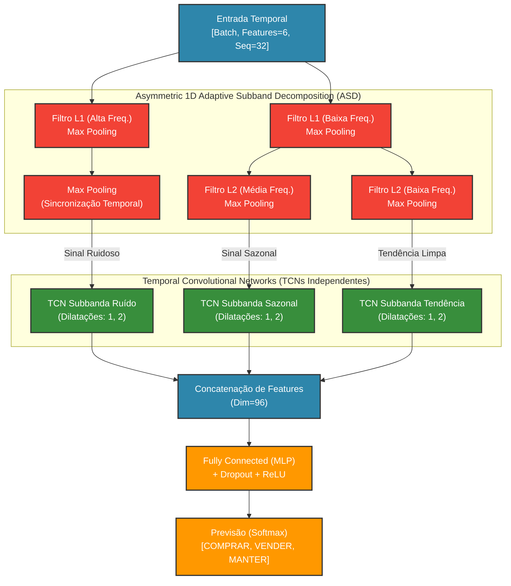
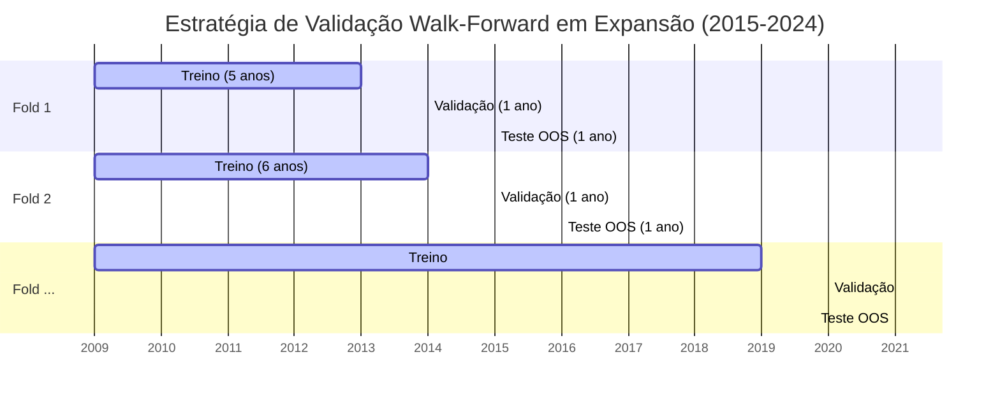
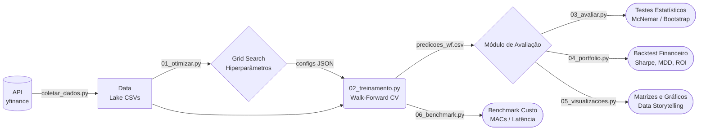

# MSR-TCN: Rede Convolucional Temporal Residual Multiescala com Decomposição Adaptativa para Previsão Financeira

[](https://www.python.org/downloads/)
[](https://pytorch.org/)
[](https://opensource.org/licenses/MIT)

Este repositório contém o código-fonte oficial e o pipeline de reprodutibilidade para o modelo **MSR-TCN (Multi-Scale Residual Temporal Convolutional Network)**, uma arquitetura de *Deep Learning* proposta para solucionar problemas de ruído de alta frequência e não-estacionariedade inerentes à previsão de séries temporais financeiras.

## 🎯 Resumo

O mercado financeiro gera dados com um altíssimo grau de estocasticidade (ruído) e não-estacionariedade (mudança de distribuições ao longo do tempo). Redes Neurais convencionais (como CNNs e LSTMs) frequentemente sofrem de *overfitting* ou falham em isolar a verdadeira tendência de longo prazo das flutuações voláteis intradiárias.

A **MSR-TCN** resolve este problema ao integrar uma **Decomposição Adaptativa em Subbandas (ASD) 1D Assimétrica** nativa à arquitetura, fragmentando o sinal financeiro bruto em três frequências distintas:
1. **Alta Frequência (Ruído):** Captura a volatilidade imediata.
2. **Média Frequência (Sazonalidade):** Captura ciclos intermédios de mercado.
3. **Baixa Frequência (Tendência):** Isola a direção subjacente do ativo.

Cada subbanda é processada por blocos isolados de **Redes Convolucionais Temporais (TCN)** com convoluções causais e dilatadas, permitindo um amplo campo receptivo (*receptive field*) sem perda de granularidade temporal.

---

## 🧠 Arquitetura do Modelo

A arquitetura ponta a ponta (*end-to-end*) do modelo processa vetores de características (Preço, Volume, Indicadores Técnicos) diretamente na série temporal.



---

## 🔬 Metodologia de Validação (Walk-Forward)

Para assegurar rigor científico e total isolamento contra vazamento de dados (*data leakage* / *look-ahead bias*), este repositório adota a Validação Cruzada *Walk-Forward* com janelas de expansão.



O conjunto de **Teste (Out-of-Sample)** avança 1 ano de cada vez. O modelo é inteiramente descartado e treinado do absoluto zero a cada iteração de teste, simulando com exatidão o ambiente produtivo e as mudanças de mercado (regimes de volatilidade).

---

## 🛠️ Pipeline de Execução MLOps

O repositório foi arquitetado sob princípios de modularidade, contendo uma trilha reprodutível e determinística ponta-a-ponta (do download do dado à avaliação financeira).



### Passo a Passo da Replicação

1. **Instalação do Ambiente:**
   ```bash
   git clone https://github.com/SeuUsuario/MSR_TCN.git
   cd MSR_TCN
   pip install -r requirements.txt
   ```

2. **Ingestão de Dados e Feature Engineering:**
   ```bash
   python src/pipeline_dados/coletar_dados.py
   ```
   > Calcula características base (RSI, MACD, ATR) e rotula topos e fundos (BUY/SELL) usando janela centralizada.

3. **Otimização de Hiperparâmetros (Grid Search):**
   ```bash
   python 01_otimizar_hiperparametros.py
   ```
   > Determina hiperparâmetros ótimos (Kernel Size, Taxa de Aprendizado) e atalhos de *Data Augmentation* por segmento econômico, salvando em `configs/`.

4. **Treinamento e Inferência Walk-Forward:**
   ```bash
   python 02_treinamento_walk_forward.py
   ```
   > Executa a bateria exaustiva (10 anos) de testes fora da amostra (*Out-of-Sample*), gerando as predições.

5. **Testes Estatísticos e Backtest:**
   ```bash
   python 03_avaliar_estatisticas.py
   python 04_avaliar_portfolio.py
   ```
   > Analisa p-valores e métricas de fundos institucionais (Drawdown, Sortino, Calmar).

6. **Benchmark de Eficiência Computacional:**
   ```bash
   python 06_benchmark_custo_computacional.py
   ```
   > Comprova a eficiência (Número de Parâmetros, MACs e Throughput/Vazão) no processador atual (CPU / MPS / CUDA).

---

## 🧬 Técnicas de Aumentação de Dados (Data Augmentation)

O mercado financeiro apresenta um profundo desbalanceamento, onde os rótulos de `MANTER (HOLD)` compõem cerca de 90% da distribuição (vs. `COMPRAR` e `VENDER`).
As seguintes técnicas são dinamicamente ajustáveis em runtime na classe `SegmentTimeSeriesDataset` (localizada em `src/utilidades.py`):

- **Jittering:** Adição de ruído gaussiano às características temporais.
- **Time-Warping:** Distorção não-linear do vetor tempo via interpolação.
- **Window-Slicing:** Redução da janela e redimensionamento interpolação escalar.
- **MixUp Temporal:** Combinação convexa de características (e Snapping de Rótulos).
- **Decomposição Aditiva:** Adição de ruído apenas ao resíduo isolado da Média Móvel.

---

## 📄 Citação e Licença

Este projeto é disponibilizado sob a Licença MIT. Para publicações acadêmicas que venham a utilizar este código, favor citar o artigo correspondente.

> *As implementações deste repositório foram desenhadas com precisão acadêmica, preservando o estado e os passos lógicos requeridos para assegurar 100% de reproducibilidade dos experimentos documentados.*
